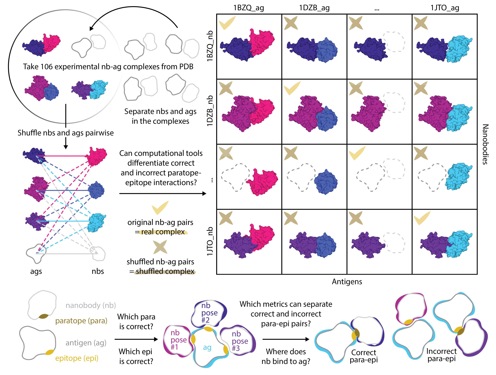

# Antibody-antigen champloo

This GitHub repository supports **"Structural Plausibility Without Binding Specificity: Limits of AI-Based Antibody-Antigen Structure Prediction Confidence Scores"** study.

The preprint: https://www.biorxiv.org/content/10.64898/2026.03.02.709004v1

Antibody-antigen binding prediction remains a central challenge for AI-driven therapeutic discovery, particularly in discriminating cognate interactions from structurally plausible but incorrect pairings. We present a controlled, AI-method- and antibody-format-agnostic evaluation framework that measures binding specificity under realistic conditions. **Using 106 experimentally determined single-chain antibody (nanobody)-antigen complexes and 11,130 shuffled non-cognate pairings, we benchmarked publicly-available state-of-the-art structure prediction methods (AlphaFold3, Boltz-2, Chai-1).** Although the methods tested often generated geometrically plausible complexes, internal confidence metrics (ipTM) frequently failed to discriminate correct from incorrect pairings. Increased sampling improved structural refinement but not pairing discrimination, indicating that computational resources are better allocated across independent seeds and explicit negative controls. We conclude that internal confidence scores are not inherently calibrated to binding specificity and require validation against realistic decoys. 

To enable community benchmarking and method development, **we release ∼1.8 million AI-generated complex structures and guidance** for the benchmarks ahead: https://doi.org/10.5281/zenodo.18390239

